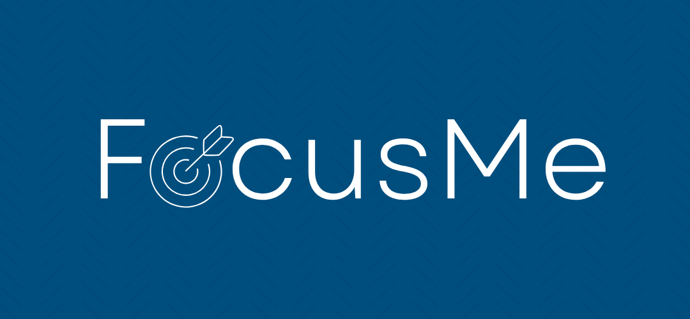

# **FocusMe**
Projeto da disciplina de Desenvolvimento de Software (2025.1) do Centro de Informática da UFPE

### **Contexto**
O projeto é uma aplicação com integração de API para inteligencia artificial generativa, e a proposta central é solucionar o problema de organização da rotina de estudos para pessoas com rotinas apertadas.

### **Equipe**
* Ádson Viana \<aav>
* Arthur Fernandes \<afol>
* Gabriel Rio \<grtc>
* Juan Lucas \<jlcm>
* Maria Amorim \<maca>
* Raul Silva \<rvas>

### **Sobre a Aplicação**

O FocusMe é um software que auxilia na organização da sua rotina de estudos com o auxílio de inteligência artificial para ajustar os melhores horários de estudos, tudo isso de maneira personalizada levando em consideração a sua rotina, disponibilidade, matérias e dificuldades. E o melhor de tudo isso é a possibilidade que o FocusMe tem de atualizar o cronograma da sua semana em tempo real, basta você enviar uma mensagem para o nosso assistente virtual, o Fábio! Entre no chat da aplicação e informe as alterações necessárias para continuar com o seu cronograma focado, funcional e atualizado para você!

### **Como Configurar o Projeto Localmente**

1. Pré-requisitos: ter instalado na máquina o [node.js](http://node.js) (pode ser baixado no site [https://nodejs.org/en](https://nodejs.org/en)), o git (pode ser baixado no site [https://git-scm.com/downloads](https://git-scm.com/downloads)) e o react (pode ser baixado e no site [https://react.dev/](https://react.dev/) ) e um editor de código
2. Clone o repositório com o comando: “git clone [https://github.com/Equipe07-DS/FocusMe.git](https://github.com/Equipe07-DS/FocusMe.git)”
3. Pelo terminal entre na pasta do backend e instale as dependências do backend pelo comando  “pip install \-r requirements.txt”
4. Em seguida, entre na pasta app e use o comando “uvicorn main:app  \--reload” (caso queira verificar se está tudo funcionando abra o navegador e coloque no endereço: “[http://localhost:8000/redoc](http://localhost:8000/redoc)”)
5. Abra outro terminal e entre na pasta do frontend e use o comando “npm install” em seguida “npm start”

# Tutorial de uso do FocusMe

### 1. Acessando o FocusMe

Ao entrar na nossa plataforma, você verá a **página inicial**, que contém:

- Uma breve descrição do nosso software
- Opções para **se cadastrar** (caso seja a primeira vez) ou **acessar sua conta**

### 2. Criando uma Conta

1. Clique em **"Cadastrar"**
2. Preencha as informações solicitadas:
    - **Nome**
    - **E-mail**
    - **Senha**
3. Ao finalizar, você será redirecionado para a tela de **criar cronograma**

### 3. Criando o seu Cronograma

Na tela de criar cronograma, informe:

- Sua **disponibilidade de horários**
- As **matérias** que deseja estudar ao longo da semana
- Detalhamentos para **cada dia da semana**, se existirem

Após preencher tudo, clique em **"Gerar Cronograma"**

### 4. Ajustando o seu Cronograma

- Você será direcionado para a **tela de chat** com o nosso chatbot
- Nessa tela você consegue:
    - Visualizar o **cronograma inicial**
    - Solicitar **alterações** ao chatbot até que fique como deseja

### 5. Salvando e Visualizando o seu Cronograma

1. Quando o cronograma estiver de acordo com o que deseja, clique em **"Salvar"** na tela de chat
2. O cronograma ficará disponível na página **"Cronograma"**, onde:
    - Suas atividades estarão divididas por dias da semana e por horário

### 6. Criando um Novo Cronograma

Na mesma tela onde visualiza seu cronograma atual, você também pode clicar para **criar um novo cronograma** sempre que precisar.
