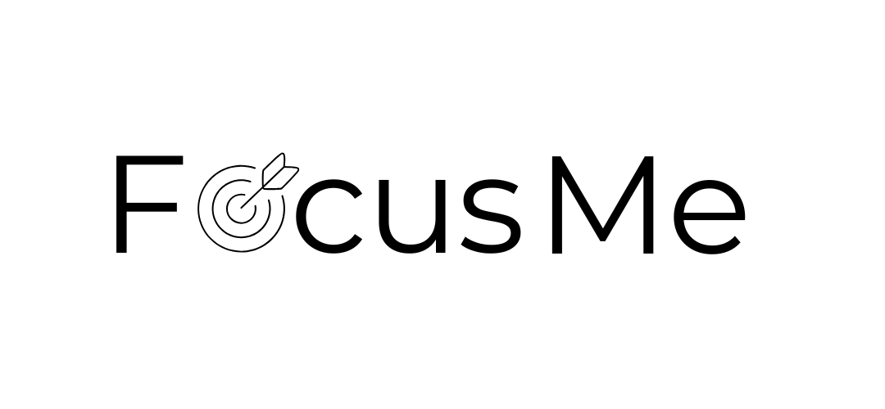

# FocusMe
Projeto da disciplina de Desenvolvimento de Software (2025.1) do Centro de Informática da UFPE

### Contexto
O projeto é uma aplicação com integração de API para inteligencia artificial generativa, e a proposta central é solucionar o problema de organização da rotina de estudos para pessoas com rotinas apertadas.

### Equipe
* Ádson Viana \<aav>
* Arthur Fernandes \<afol>
* Gabriel Rio \<grtc>
* Juan Lucas \<jlcm>
* Luiz Veloso \<lmvs>
* Maria Amorim \<maca>
* Vitória das Dores \<vdsn>

### Sobre a Aplicação

(em progresso)

### Como Configurar o Projeto Localmente
* Pré-requisitos: ter instalado na máquina o node.js (pode ser baixado no site https://nodejs.org/en), o git (pode ser baixado no site https://git-scm.com/downloads) e o react (pode ser baixado e no site https://react.dev/ ) e um editor de código
* Clone o repositório com o comando: “git clone https://github.com/Equipe07-DS/FocusMe.git”
* Pelo terminal entre na pasta do backend e instale as dependências do backend pelo comando “pip install -r requirements.txt”
* Em seguida, entre na pasta app e use o comando “uvicorn main:app --reload” (caso queira verificar se está tudo funcionando abra o navegador e coloque no endereço: “http://localhost:8000/redoc”)
* Abra outro terminal e entre na pasta do frontend e use o comando “npm install” em seguida “npm start”
